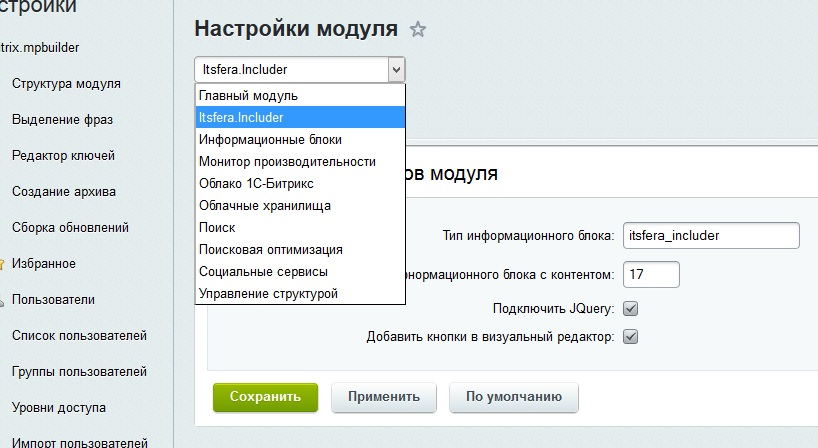

#itsfera.includer модуль для 1c-bitrix

Модуль для встраивания компонентов в динамический контент, например для вставки фото слайдера в новость или статью.

Для пользователей старого визуального редактора модуль добавляет кнопки для встакок.
Модуль работает на обработчике события OnEndBufferContentHandler после формирования контента всего сайта,
поэтому вставка мета тегов возможна в любом месте сайта.

##Для кого?:
Разработчики и обученные контент менеджеры

##Как это работает?
1. На страницы настроек модуля указываете тип инфоблока и инфблок.



2. Где угодно в тексте на сайте добавляете мета тег [list]section_code_or_id[/list] или [detail]element_code_or_id[/detail],
где section_code_or_id - это либо код, либо айди раздела, а element_code_or_id - соответственно код или айди элемента инфоблока заданного в настройках
3. Все.

В результате вместо мета тегов вставятся компоненты news.list вместо [list] и news.detail вместо [detail].
Компоненты используют шаблоны news.list/itsfera.includer и news.detail/itsfera.includer , 
которые после установки находятся в папке шаблона /bitrix/templates/.default/components/bitrix/ .
и которые можно изменять под свой вкус.

##После установки модуля, 
Вам станет доступен демонстрационный инфоблок с демо данными.  Если все установилось правильно, вставка [list]demo-1[/list] в любом месте сайт выведет слайдер с фотографиями.
Попробуйте вставить [list]demo-1[/list] в текст элемента инфоблока.

##Обработчики событий
В модуле добавлены обработчики события OnBeforeMakeList с параметрами ($iSectionId,$iIblockID) для [list] и OnBeforeMakeDetail с параметрами ($iElementId,$iIblockID) для [detail]

Пример использования обработчиков событий:

если добавим такой код в init.php:

```php
AddEventHandler("itsfera.includer", "OnBeforeMakeDetail", "OnBeforeMakeDetailHandler");
function OnBeforeMakeDetailHandler($iDetailId,$iIblockId)
{
    ob_start();
	$GLOBALS["APPLICATION"]->IncludeComponent(
	   "bitrix:voting.current",
	   "main_page",
	   Array(
		  "CHANNEL_SID" => "ANKETA",
		  "VOTE_ID" => iDetailId,
		  "CACHE_TYPE"   =>   "A",
		  "CACHE_TIME"   =>   "3600",
		  "AJAX_MODE" => "N",
		  "AJAX_OPTION_SHADOW" => "Y",
		  "AJAX_OPTION_JUMP" => "Y",
		  "AJAX_OPTION_STYLE" => "Y",
		  "AJAX_OPTION_HISTORY" => "N",
	   )
	);
	return ob_get_clean();
}
```

и вставим в новость [detail]5[/detail], то получим вывод компонента голосования c VOTE_ID=5

Возможные проблемы
* Неверно задан инфоблок в настройках модуля
* Неверно установлены права для инфоблока.
* Несуществует элемент или раздел с таким кодом или айди.
    + В таких случаях на месте мета тега [detail] появится текст: "Элемент не найден!"
* При выводе слайдер произошел конфликт jQuery. Варианты решения:
	+ отключить подключение jQuery в настройках модуля
	+ изменить шаблон компонента news.list/itsfera.includer
* Выпадающий список доступен только в старом визуальном редакторе и если в настройках усановлена галочка "Добавить кнопки в визуальный редактор:"
